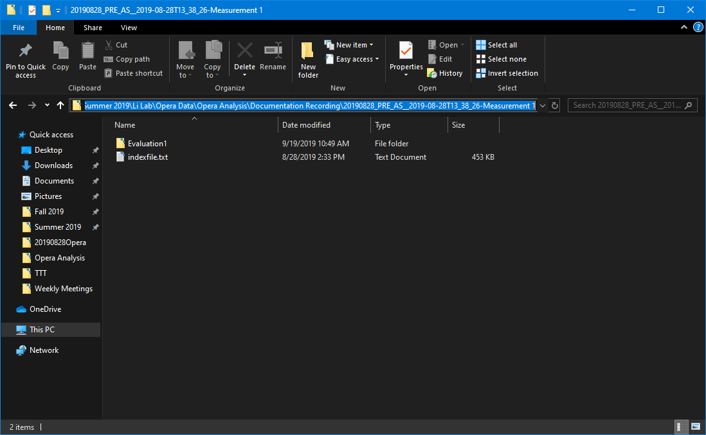
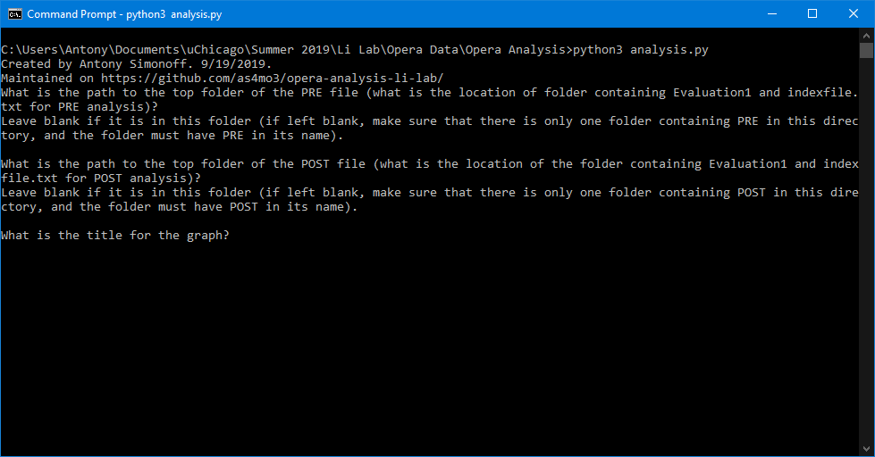

## Documentation for:

# analysis.exe for Li Lab

Created by Antony Simonoff, 9/19/2019

Contents:

1.  Overview
    
    1.  Output files

2.  Downloading analysis.exe

3.  Using analysis.exe
    
    2.  Finding file paths
        
        1.  Leaving the path blank
    
    3.  Choosing the graph title
    
    4.  Choosing positive control wells
    
    5.  Preliminary screening vs repeat candidates
    
    6.  Preliminary screening
        
        2.  Graphing both libraries on one axes (or not)
        
        3.  Choosing names for each library
    
    7.  Repeat candidates
        
        4.  Naming repeat candidates

4.  Output files

5.  Modifying color list

6.  Updates and Contacting 

<!-- end list -->

---

1.  Overview

analysis.exe is created and maintained by Antony Simonoff on
(<https://github.com/as4mo3/opera-analysis-li-lab>).

analysis.exe was created to speed up Opera data analysis from standard
Opera usage for the Li Lab at the University of Peking. analysis.exe can
be used for both preliminary screening result graphing, or repeat
candidate graphing, which includes error bars. analysis.exe also outputs
an Excel file with the analyzed data for user analysis after the
graphing process. This output file also contains average and standard
deviation values for the appropriate repeat candidates.

1.  a. Output Files

analysis.exe outputs an Excel file, with a title specified during step
3.b. It also outputs one or two graphs as the .png filetype, with names
specified in either step 3.e.ii. for preliminary library analysis, or
3.b. for repeat candidates. These files are located in the same
directory as analysis.exe itself.

2.  Downloading analysis.exe

analysis.exe can be downloaded from
(<https://github.com/as4mo3/opera-analysis-li-lab>). The direct download
link is
(<https://github.com/as4mo3/opera-analysis-li-lab/raw/master/analysis.exe>).

3.  Using analysis.exe

> The following sections document how to use analysis.exe, with visual
> aids.

3\. a. Finding file paths

The first part of graphing involves specifying the location of the
evaluation files. To do this, navigate to your Opera file locations
(fig. 1), and enter the Pre folder (fig. 2). Then, select the file path,
and copy and paste it into the analysis.exe dialog box. Repeat for the
Post file.

Figure 1. Navigating to Opera Analysis locations.

Figure 2. Navigating to the PRE folder.

Figure 3. Selecting the PRE folder path.

3\. a. i. Leaving the path blank

If analysis.exe is placed into a folder containing only the relative PRE
and POST files, such as in Figure 1, their path locations do not have to
be specified. As long as the files have ‘PRE’ and ‘POST’ in their names,
analysis.exe will be able to find them automatically. However, this will
only work for one PRE and POST file each, so do NOT leave the path blank
if your folder contains more than one of each.

3\. b. Choosing the graph title

For the next step, the dialog will ask for the graph title (fig. 4).
This title will be used to label the output graphs and Excel documents.

Figure 4. Choosing a title.

3\. c. Choosing positive control wells.

Now, the dialog box will ask if there exist positive controls (fig. 5).
If your plate has positive controls, simply enter ‘Y’ (fig. 6). If not,
simply enter ‘N’ and continue on to step 3. d.

Figure 5. Are there positive controls?

Then, the dialog box will ask for the top left and bottom right corners
of the positive controls. For example, if your positive controls are in
wells G6, G7, H6, and H7, enter ‘G6’ for the top left location, and ‘H7’
for the bottom right (fig. 6). This also works the same way if the
controls are all in a line.

Figure 6. Choosing positive control locations.

3\. d. Preliminary screening vs repeat candidates.

Now, the dialog will ask if you want to screen for a preliminary
screening, with two libraries on the plate, or repeat candidates
testing. If your plate is for a preliminary screening ‘Y’ (fig. 7). If
not, simply enter ‘N’ and continue on to step 3. f.

Figure 7. Choosing preliminary vs repeat screenings.

3\. e. Preliminary screening

3\. e. i. Graphing both libraries on one set of axes.

Now, the dialog will ask if you want to graph both libraries on one axes
(fig. 8). Simply enter ‘Y’ to see both libraries on one set of axes.
Enter ‘N’ if you want two graphs, one for each library. In this case,
each library will also have the positive controls on their graph (if
appropriate). 

Figure 8. Choosing axes for preliminary screening.

3\. e. ii. Choosing library names.

Now, the dialog will ask you for the name of each library (fig. 9). The
names you give each library will also be what the output files are
named. At this point, the dialog will close, and output the files (see
step 4).

Figure 9. Choosing library names.

3\. f. Repeat candidates.

If this plate is for repeat candidates, make sure to say ‘N’ during step
3. d. (fig. 10). 

Figure 10. Choosing repeat candidate screening.

analysis.exe assumes the location of each candidate is as follows: Each
repeat candidate is in a sequence of 3 horizontal wells. This means
there are 4 repeat candidates per row, and, with 8 columns, a total of
32 repeat candidates are possible. If your plate does not have 32 repeat
candidates, analysis.exe will ignore the wells with nothing in them.

3\. f. i. Naming repeat candidates.

Now, the dialog box will ask if you want to label each candidate (fig.
11). If you do not want to label candidates, simply enter ‘N’. If you DO
want to label candidates, select ‘Y’. The dialog box will then ask you
to label each candidate.

If you select ‘N’, or you select ‘Y’ then leave the name blank, the
candidates will be labeled in a sequential order, using the name “Rpt
Candidate \#X”, where X is the number of the candidate.

Figure 11. Labeling each repeat candidate.

4\. Output files

Each use of analysis.exe will output an Excel file, and graph(s). These
files will be output to the same location as the analysis.exe file
itself.

The Excel file will contain the maximum brightness matrix and the dF/d0
matrix. Also, if the plate is used for repeat candidate screening, the
Excel file will also contain the average X and Y values, and well as the
appropriate standard deviations, of each candidate.

The graph(s) will be outputted as .png files.

5\. Modifying color list

The standard color list used by analysis.exe is located in the
colors.txt file. Downloading this colors.txt file is not necessary for
running analysis.exe and graphing. However, if you want to change the
default colors for each candidate on the graph, download colors.txt.
Then, place colors.txt into the same directory as analysis.exe, and
change the color names in colors.txt. The list of available colors can
be found here
(<https://matplotlib.org/3.1.0/gallery/color/named_colors.html>).

6\. Updates and Contacting

analysis.exe and its Python files are maintained on
(<https://github.com/as4mo3/opera-analysis-li-lab>). If you find any
errors, do not hesitate to contact Antony Simonoff at
(<asimonoff1101@gmail.com>).
